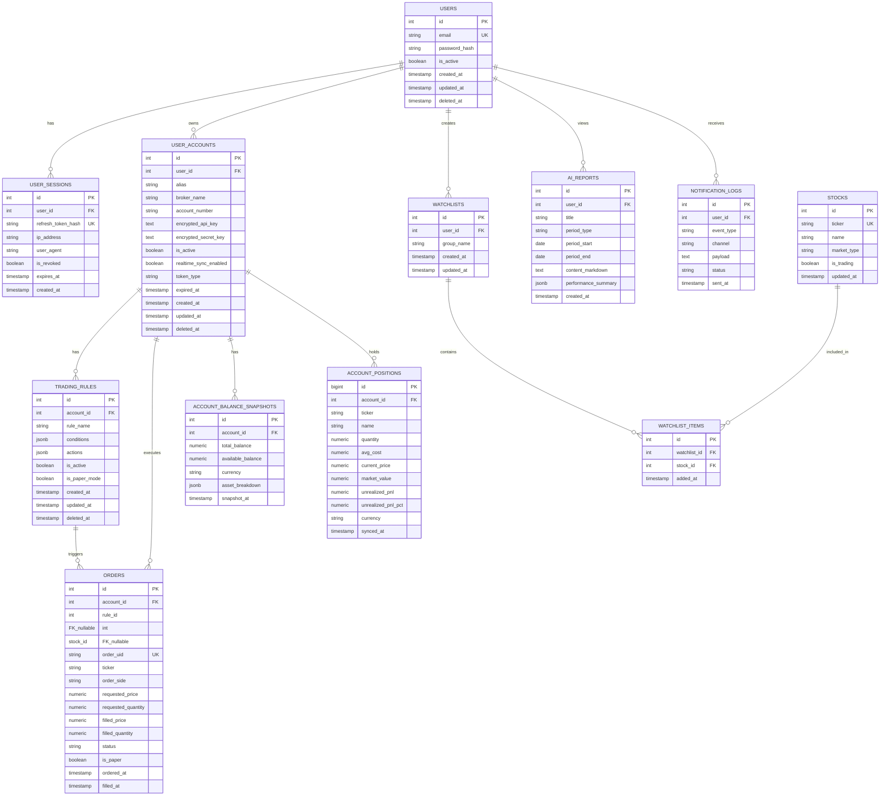

# MyFin V2.0 데이터베이스 설계서 (ERD & Schema)

> **RDBMS:** PostgreSQL 16
> **ORM:** SQLAlchemy 2.0 (async + asyncpg 드라이버)
> **설계 원칙:** CQRS - PostgreSQL은 ACID 트랜잭션·무결성 전담, 대용량 시계열·로그는 Elasticsearch 전담

---

## 1. 전체 ERD (Mermaid)



---

## 2. 테이블 물리 스펙 (Physical Schema)

### 2.1 `users` — 사용자 마스터

**역할:** 인증 주체. 시스템의 루트 엔티티.
**보안:** 비밀번호는 Argon2id (메모리: 65536 KB, 반복: 3, 병렬: 4) 단방향 해싱.

| 컬럼명 | 타입 | 제약 | 설명 |
| --- | --- | --- | --- |
| `id` | `SERIAL` | `PRIMARY KEY` | 자동 증가 정수 PK |
| `email` | `VARCHAR(255)` | `UNIQUE NOT NULL` | 로그인 식별자 |
| `password_hash` | `VARCHAR(255)` | `NOT NULL` | Argon2id 해시 |
| `is_active` | `BOOLEAN` | `NOT NULL DEFAULT TRUE` | 계정 활성 여부 (관리자 비활성화용) |
| `created_at` | `TIMESTAMPTZ` | `NOT NULL DEFAULT NOW()` | 가입 일시 |
| `updated_at` | `TIMESTAMPTZ` | `NOT NULL DEFAULT NOW()` | 정보 변경 일시 |
| `deleted_at` | `TIMESTAMPTZ` | `NULL` | 소프트 삭제 일시 (`NULL`이면 활성) |

**DDL:**
```sql
CREATE TABLE users (
    id          SERIAL PRIMARY KEY,
    email       VARCHAR(255) UNIQUE NOT NULL,
    password_hash VARCHAR(255) NOT NULL,
    is_active   BOOLEAN NOT NULL DEFAULT TRUE,
    created_at  TIMESTAMPTZ NOT NULL DEFAULT NOW(),
    updated_at  TIMESTAMPTZ NOT NULL DEFAULT NOW(),
    deleted_at  TIMESTAMPTZ NULL
);

CREATE INDEX idx_users_email ON users (email) WHERE deleted_at IS NULL;
CREATE TRIGGER trg_users_updated_at
    BEFORE UPDATE ON users
    FOR EACH ROW EXECUTE FUNCTION update_updated_at_column();
```

---

### 2.2 `user_sessions` — 세션 및 Refresh Token 관리

**역할:** OWASP A07 대응. Refresh Token 무효화(로그아웃·탈취 감지) 및 다중 디바이스 세션 추적.
**설계 결정:** Refresh Token 원문은 저장하지 않고 `SHA-256(token)` 해시만 저장. 탈취 시 DB 해킹으로도 실제 토큰 복원 불가.

| 컬럼명 | 타입 | 제약 | 설명 |
| --- | --- | --- | --- |
| `id` | `SERIAL` | `PRIMARY KEY` | |
| `user_id` | `INT` | `FK users(id) ON DELETE CASCADE NOT NULL` | 세션 소유자 |
| `refresh_token_hash` | `VARCHAR(64)` | `UNIQUE NOT NULL` | SHA-256 해시값 (hex 64자) |
| `ip_address` | `VARCHAR(45)` | `NULL` | 로그인 IP (IPv4 15자, IPv6 39자, 최대 45자) |
| `user_agent` | `TEXT` | `NULL` | 브라우저·클라이언트 정보 |
| `is_revoked` | `BOOLEAN` | `NOT NULL DEFAULT FALSE` | 명시적 무효화 여부 (로그아웃 시 TRUE) |
| `expires_at` | `TIMESTAMPTZ` | `NOT NULL` | 세션 만료 시각 |
| `created_at` | `TIMESTAMPTZ` | `NOT NULL DEFAULT NOW()` | 세션 생성 시각 |

**DDL:**
```sql
CREATE TABLE user_sessions (
    id                  SERIAL PRIMARY KEY,
    user_id             INT NOT NULL REFERENCES users(id) ON DELETE CASCADE,
    refresh_token_hash  VARCHAR(64) UNIQUE NOT NULL,
    ip_address          VARCHAR(45) NULL,
    user_agent          TEXT NULL,
    is_revoked          BOOLEAN NOT NULL DEFAULT FALSE,
    expires_at          TIMESTAMPTZ NOT NULL,
    created_at          TIMESTAMPTZ NOT NULL DEFAULT NOW()
);

CREATE INDEX idx_sessions_user_id   ON user_sessions (user_id);
CREATE INDEX idx_sessions_token_hash ON user_sessions (refresh_token_hash)
    WHERE is_revoked = FALSE AND expires_at > NOW();
```

> [!note] Refresh Token Rotation 정책
> Refresh Token 사용 시마다 기존 세션의 `is_revoked = TRUE`로 변경하고 새 세션 레코드를 생성한다. 이미 무효화된 토큰 재사용이 감지되면 해당 `user_id`의 모든 세션을 즉시 무효화한다 (탈취 의심).

---

### 2.3 `user_accounts` — 다중 계좌 및 API Key 마스터

**역할:** 증권사·거래소 계좌 연동. API Key 라이프사이클 추적.
**보안:** OWASP A02 대응. API Key 쌍은 Fernet(AES-128-CBC + HMAC-SHA256) 암호화하여 저장.

| 컬럼명 | 타입 | 제약 | 설명 |
| --- | --- | --- | --- |
| `id` | `SERIAL` | `PRIMARY KEY` | |
| `user_id` | `INT` | `FK users(id) ON DELETE CASCADE NOT NULL` | 계좌 소유자 |
| `alias` | `VARCHAR(100)` | `NULL` | 사용자 지정 계좌 별칭 (예: "메인 국장 계좌") |
| `broker_name` | `VARCHAR(50)` | `NOT NULL` | 증권사 코드 (`korea_investment`, `upbit`, `binance`) |
| `account_number` | `VARCHAR(50)` | `NOT NULL` | 계좌번호 (암호화 대상 아님, 식별자 역할) |
| `encrypted_api_key` | `TEXT` | `NOT NULL` | Fernet 암호화된 Public API Key |
| `encrypted_secret_key` | `TEXT` | `NOT NULL` | Fernet 암호화된 Secret/Private Key |
| `is_active` | `BOOLEAN` | `NOT NULL DEFAULT TRUE` | Kill-Switch 상태 플래그 |
| `realtime_sync_enabled` | `BOOLEAN` | `NOT NULL DEFAULT FALSE` | 장중 5분 간격 실시간 동기화 활성화 여부. `FALSE`(기본) = 일 1회 장마감 스냅샷만 수행. 상세 설계 → [[12_동기화_전략_설계]] |
| `token_type` | `VARCHAR(20)` | `NOT NULL CHECK (token_type IN ('DYNAMIC', 'STATIC'))` | 키 유형 |
| `expired_at` | `TIMESTAMPTZ` | `NULL` | STATIC 키 고정 만료일 (`NULL`이면 만료 없음) |
| `created_at` | `TIMESTAMPTZ` | `NOT NULL DEFAULT NOW()` | |
| `updated_at` | `TIMESTAMPTZ` | `NOT NULL DEFAULT NOW()` | 마지막 토큰 갱신 시각 |
| `deleted_at` | `TIMESTAMPTZ` | `NULL` | 소프트 삭제 |

**DDL:**
```sql
CREATE TABLE user_accounts (
    id                      SERIAL PRIMARY KEY,
    user_id                 INT NOT NULL REFERENCES users(id) ON DELETE CASCADE,
    alias                   VARCHAR(100) NULL,
    broker_name             VARCHAR(50)  NOT NULL,
    account_number          VARCHAR(50)  NOT NULL,
    encrypted_api_key       TEXT NOT NULL,
    encrypted_secret_key    TEXT NOT NULL,
    is_active               BOOLEAN NOT NULL DEFAULT TRUE,
    realtime_sync_enabled   BOOLEAN NOT NULL DEFAULT FALSE,
    token_type              VARCHAR(20) NOT NULL CHECK (token_type IN ('DYNAMIC', 'STATIC')),
    expired_at              TIMESTAMPTZ NULL,
    created_at              TIMESTAMPTZ NOT NULL DEFAULT NOW(),
    updated_at              TIMESTAMPTZ NOT NULL DEFAULT NOW(),
    deleted_at              TIMESTAMPTZ NULL
);

CREATE INDEX idx_accounts_user_id    ON user_accounts (user_id) WHERE deleted_at IS NULL;
CREATE INDEX idx_accounts_expiry     ON user_accounts (expired_at)
    WHERE token_type = 'STATIC' AND expired_at IS NOT NULL AND deleted_at IS NULL;
CREATE TRIGGER trg_accounts_updated_at
    BEFORE UPDATE ON user_accounts
    FOR EACH ROW EXECUTE FUNCTION update_updated_at_column();
```

---

### 2.4 `account_balance_snapshots` — 잔고 스냅샷 이력 *(신규)*

**역할:** 대시보드 총 자산 표시 및 일별 수익률 계산용. Celery Beat가 매일 장 마감 후 1회 수집.
**설계 결정:** 실시간 잔고는 증권사 API에서 직접 조회하고, 스냅샷은 일별 히스토리 용도로만 사용.

| 컬럼명 | 타입 | 제약 | 설명 |
| --- | --- | --- | --- |
| `id` | `SERIAL` | `PRIMARY KEY` | |
| `account_id` | `INT` | `FK user_accounts(id) ON DELETE CASCADE NOT NULL` | 대상 계좌 |
| `total_balance` | `NUMERIC(20, 4)` | `NOT NULL` | 총 평가 금액 |
| `available_balance` | `NUMERIC(20, 4)` | `NOT NULL` | 주문 가능 금액 |
| `currency` | `VARCHAR(10)` | `NOT NULL DEFAULT 'KRW'` | 기준 통화 |
| `asset_breakdown` | `JSONB` | `NULL` | 보유 종목별 수량·평가금액 JSON |
| `snapshot_at` | `TIMESTAMPTZ` | `NOT NULL DEFAULT NOW()` | 수집 시각 |

**DDL:**
```sql
CREATE TABLE account_balance_snapshots (
    id                SERIAL PRIMARY KEY,
    account_id        INT NOT NULL REFERENCES user_accounts(id) ON DELETE CASCADE,
    total_balance     NUMERIC(20, 4) NOT NULL,
    available_balance NUMERIC(20, 4) NOT NULL,
    currency          VARCHAR(10) NOT NULL DEFAULT 'KRW',
    asset_breakdown   JSONB NULL,
    snapshot_at       TIMESTAMPTZ NOT NULL DEFAULT NOW()
);

CREATE INDEX idx_snapshots_account_id ON account_balance_snapshots (account_id, snapshot_at DESC);
```

---

### 2.5 `account_positions` — 보유 종목 현황 *(신규)*

**역할:** 계좌별 현재 보유 종목의 수량·평가금액·손익을 저장. Celery 동기화 태스크가 UPSERT 방식으로 갱신.
**설계 결정:**
- `asset_breakdown JSONB` (balance_snapshots 내)는 일별 이력 보존용으로만 유지
- 이 테이블은 **현재 시점 포지션 전용** (히스토리 불필요 → `UNIQUE(account_id, ticker)` ON CONFLICT UPSERT)
- `realtime_sync_enabled=TRUE` 계좌는 5분 간격, `FALSE` 계좌는 일 1회 갱신
- 상세 동기화 전략 → [[12_동기화_전략_설계]]

| 컬럼명 | 타입 | 제약 | 설명 |
|---|---|---|---|
| `id` | `BIGSERIAL` | `PRIMARY KEY` | 자동 증가 |
| `account_id` | `INT` | `FK user_accounts(id) ON DELETE CASCADE NOT NULL` | 계좌 |
| `ticker` | `VARCHAR(30)` | `NOT NULL` | 종목코드 (예: `005930`, `KRW-BTC`) |
| `name` | `VARCHAR(100)` | `NULL` | 종목명 (브로커 응답 그대로) |
| `quantity` | `NUMERIC(20,8)` | `NOT NULL` | 보유수량 |
| `avg_cost` | `NUMERIC(20,4)` | `NULL` | 매수 평균단가 |
| `current_price` | `NUMERIC(20,4)` | `NULL` | 동기화 시점 현재가 |
| `market_value` | `NUMERIC(20,4)` | `NULL` | 평가금액 (qty × current_price) |
| `unrealized_pnl` | `NUMERIC(20,4)` | `NULL` | 평가손익 (금액) |
| `unrealized_pnl_pct` | `NUMERIC(8,4)` | `NULL` | 수익률 (%) |
| `currency` | `VARCHAR(10)` | `NOT NULL DEFAULT 'KRW'` | 기준 통화 |
| `synced_at` | `TIMESTAMPTZ` | `NOT NULL` | 마지막 동기화 시각 |

**DDL:**
```sql
CREATE TABLE account_positions (
    id                 BIGSERIAL PRIMARY KEY,
    account_id         INT          NOT NULL REFERENCES user_accounts(id) ON DELETE CASCADE,
    ticker             VARCHAR(30)  NOT NULL,
    name               VARCHAR(100) NULL,
    quantity           NUMERIC(20, 8) NOT NULL,
    avg_cost           NUMERIC(20, 4) NULL,
    current_price      NUMERIC(20, 4) NULL,
    market_value       NUMERIC(20, 4) NULL,
    unrealized_pnl     NUMERIC(20, 4) NULL,
    unrealized_pnl_pct NUMERIC(8, 4)  NULL,
    currency           VARCHAR(10)  NOT NULL DEFAULT 'KRW',
    synced_at          TIMESTAMPTZ  NOT NULL,
    CONSTRAINT uq_account_positions UNIQUE (account_id, ticker)
);

CREATE INDEX idx_positions_account     ON account_positions (account_id, synced_at DESC);
CREATE INDEX idx_positions_ticker      ON account_positions (ticker);
CREATE INDEX idx_positions_pnl         ON account_positions (account_id, unrealized_pnl_pct DESC);
```

**UPSERT 패턴:**
```sql
INSERT INTO account_positions (account_id, ticker, name, quantity, avg_cost,
    current_price, market_value, unrealized_pnl, unrealized_pnl_pct, currency, synced_at)
VALUES (...)
ON CONFLICT (account_id, ticker) DO UPDATE SET
    name               = EXCLUDED.name,
    quantity           = EXCLUDED.quantity,
    avg_cost           = EXCLUDED.avg_cost,
    current_price      = EXCLUDED.current_price,
    market_value       = EXCLUDED.market_value,
    unrealized_pnl     = EXCLUDED.unrealized_pnl,
    unrealized_pnl_pct = EXCLUDED.unrealized_pnl_pct,
    synced_at          = EXCLUDED.synced_at;

-- 청산된 종목 제거 (브로커 응답에 없는 ticker 삭제)
DELETE FROM account_positions
WHERE account_id = :account_id
  AND ticker != ALL(:active_tickers);
```

---

### 2.6 `stocks` — 종목 마스터

**역할:** 시스템 전체에서 사용되는 주식·크립토 자산의 기준 데이터.

| 컬럼명 | 타입 | 제약 | 설명 |
| --- | --- | --- | --- |
| `id` | `SERIAL` | `PRIMARY KEY` | |
| `ticker` | `VARCHAR(30)` | `UNIQUE NOT NULL` | 종목 코드 (예: `005930`, `KRW-BTC`, `BTCUSDT`) |
| `name` | `VARCHAR(100)` | `NOT NULL` | 종목명 (예: `삼성전자`, `Bitcoin`) |
| `market_type` | `VARCHAR(30)` | `NOT NULL CHECK (market_type IN ('KOSPI', 'KOSDAQ', 'UPBIT', 'BINANCE', 'BINANCE_FUTURES'))` | 시장 분류 |
| `is_trading` | `BOOLEAN` | `NOT NULL DEFAULT TRUE` | 현재 거래 가능 여부 |
| `updated_at` | `TIMESTAMPTZ` | `NOT NULL DEFAULT NOW()` | 최종 업데이트 |

**DDL:**
```sql
CREATE TABLE stocks (
    id           SERIAL PRIMARY KEY,
    ticker       VARCHAR(30) UNIQUE NOT NULL,
    name         VARCHAR(100) NOT NULL,
    market_type  VARCHAR(30) NOT NULL CHECK (
        market_type IN ('KOSPI', 'KOSDAQ', 'UPBIT', 'BINANCE', 'BINANCE_FUTURES')
    ),
    is_trading   BOOLEAN NOT NULL DEFAULT TRUE,
    updated_at   TIMESTAMPTZ NOT NULL DEFAULT NOW()
);

CREATE INDEX idx_stocks_market ON stocks (market_type) WHERE is_trading = TRUE;
```

---

### 2.6 `watchlists` & `watchlist_items` — 관심종목

**역할:** 사용자 커스텀 자산 감시 그룹 관리 (M:N 관계 해소용 브릿지 테이블).

**[watchlists]**

| 컬럼명 | 타입 | 제약 | 설명 |
| --- | --- | --- | --- |
| `id` | `SERIAL` | `PRIMARY KEY` | |
| `user_id` | `INT` | `FK users(id) ON DELETE CASCADE NOT NULL` | |
| `group_name` | `VARCHAR(100)` | `NOT NULL` | 예: "성장주 테마", "코인 단기" |
| `created_at` | `TIMESTAMPTZ` | `NOT NULL DEFAULT NOW()` | |
| `updated_at` | `TIMESTAMPTZ` | `NOT NULL DEFAULT NOW()` | |

**[watchlist_items]**

| 컬럼명 | 타입 | 제약 | 설명 |
| --- | --- | --- | --- |
| `id` | `SERIAL` | `PRIMARY KEY` | |
| `watchlist_id` | `INT` | `FK watchlists(id) ON DELETE CASCADE NOT NULL` | |
| `stock_id` | `INT` | `FK stocks(id) ON DELETE CASCADE NOT NULL` | |
| `added_at` | `TIMESTAMPTZ` | `NOT NULL DEFAULT NOW()` | |

**DDL:**
```sql
CREATE TABLE watchlists (
    id          SERIAL PRIMARY KEY,
    user_id     INT NOT NULL REFERENCES users(id) ON DELETE CASCADE,
    group_name  VARCHAR(100) NOT NULL,
    created_at  TIMESTAMPTZ NOT NULL DEFAULT NOW(),
    updated_at  TIMESTAMPTZ NOT NULL DEFAULT NOW()
);
CREATE INDEX idx_watchlists_user_id ON watchlists (user_id);

CREATE TABLE watchlist_items (
    id            SERIAL PRIMARY KEY,
    watchlist_id  INT NOT NULL REFERENCES watchlists(id) ON DELETE CASCADE,
    stock_id      INT NOT NULL REFERENCES stocks(id) ON DELETE CASCADE,
    added_at      TIMESTAMPTZ NOT NULL DEFAULT NOW(),
    UNIQUE (watchlist_id, stock_id)   -- 동일 종목 중복 등록 방지
);
CREATE INDEX idx_watchlist_items_watchlist ON watchlist_items (watchlist_id);
CREATE INDEX idx_watchlist_items_stock     ON watchlist_items (stock_id);
```

---

### 2.7 `trading_rules` — 자동 매매 룰

**역할:** 매매 봇의 조건·액션 정의. Celery Worker가 이 레코드를 구독하여 실행.
**설계 결정:** 조건(conditions)과 액션(actions)은 JSONB로 저장. 지표 종류 확장 시 DDL 변경 없이 스키마 진화 가능.

| 컬럼명 | 타입 | 제약 | 설명 |
| --- | --- | --- | --- |
| `id` | `SERIAL` | `PRIMARY KEY` | |
| `account_id` | `INT` | `FK user_accounts(id) ON DELETE CASCADE NOT NULL` | 연결 계좌 |
| `rule_name` | `VARCHAR(100)` | `NOT NULL` | 룰 이름 |
| `conditions` | `JSONB` | `NOT NULL` | 매매 발동 조건 트리거 JSON |
| `actions` | `JSONB` | `NOT NULL` | 발동 시 주문 액션 JSON |
| `is_active` | `BOOLEAN` | `NOT NULL DEFAULT TRUE` | 룰 동작 제어 스위치 |
| `is_paper_mode` | `BOOLEAN` | `NOT NULL DEFAULT FALSE` | 모의투자 모드 플래그 |
| `created_at` | `TIMESTAMPTZ` | `NOT NULL DEFAULT NOW()` | |
| `updated_at` | `TIMESTAMPTZ` | `NOT NULL DEFAULT NOW()` | |
| `deleted_at` | `TIMESTAMPTZ` | `NULL` | 소프트 삭제 |

**conditions JSONB 스키마 예시:**
```json
{
  "ticker": "KRW-BTC",
  "indicator": "MA_CROSS",
  "short_term": 15,
  "long_term": 50,
  "trigger": "UPWARD",
  "interval": "1m"
}
```

**actions JSONB 스키마 예시:**
```json
{
  "order_side": "BUY",
  "amount_type": "PERCENTAGE",
  "value": 10,
  "order_type": "MARKET",
  "stop_loss_pct": 3.0,
  "take_profit_pct": 5.0
}
```

**DDL:**
```sql
CREATE TABLE trading_rules (
    id           SERIAL PRIMARY KEY,
    account_id   INT NOT NULL REFERENCES user_accounts(id) ON DELETE CASCADE,
    rule_name    VARCHAR(100) NOT NULL,
    conditions   JSONB NOT NULL,
    actions      JSONB NOT NULL,
    is_active    BOOLEAN NOT NULL DEFAULT TRUE,
    is_paper_mode BOOLEAN NOT NULL DEFAULT FALSE,
    created_at   TIMESTAMPTZ NOT NULL DEFAULT NOW(),
    updated_at   TIMESTAMPTZ NOT NULL DEFAULT NOW(),
    deleted_at   TIMESTAMPTZ NULL
);

CREATE INDEX idx_rules_account_id  ON trading_rules (account_id) WHERE deleted_at IS NULL;
CREATE INDEX idx_rules_active      ON trading_rules (is_active) WHERE deleted_at IS NULL;
CREATE INDEX idx_rules_conditions  ON trading_rules USING GIN (conditions);
CREATE TRIGGER trg_rules_updated_at
    BEFORE UPDATE ON trading_rules
    FOR EACH ROW EXECUTE FUNCTION update_updated_at_column();
```

---

### 2.8 `orders` — 주문 트랜잭션 원장 (Ground Truth)

**역할:** 모든 주문의 최종 무결성 데이터. 금전이 오간 기록의 원천.
**CQRS 분리:** 세부 에러 내역, API 응답 원문, 실행 레이턴시는 Elasticsearch에. 주문 최종 스냅샷(체결 가격·수량·상태)만 여기에 적재.
**설계 변경 (v2.0):** `rule_id`를 `NULL` 허용으로 변경 (수동 주문 또는 관리자 주문 대응).

| 컬럼명 | 타입 | 제약 | 설명 |
| --- | --- | --- | --- |
| `id` | `SERIAL` | `PRIMARY KEY` | |
| `account_id` | `INT` | `FK user_accounts(id) NOT NULL` | 주문 계좌 |
| `rule_id` | `INT` | `FK trading_rules(id) NULL` | 트리거 룰 (`NULL`이면 수동 주문) |
| `stock_id` | `INT` | `FK stocks(id) NULL` | 종목 참조 (`NULL`이면 마스터 미등록 종목) |
| `order_uid` | `VARCHAR(100)` | `UNIQUE NOT NULL` | 증권사/거래소 고유 주문번호 |
| `ticker` | `VARCHAR(30)` | `NOT NULL` | 종목 코드 (비정규화, 조회 성능용) |
| `order_side` | `VARCHAR(10)` | `NOT NULL CHECK (order_side IN ('BUY', 'SELL'))` | 매수/매도 |
| `requested_price` | `NUMERIC(20, 4)` | `NOT NULL` | 주문 요청 단가 (시장가 시 0) |
| `requested_quantity` | `NUMERIC(20, 8)` | `NOT NULL` | 주문 요청 수량 |
| `filled_price` | `NUMERIC(20, 4)` | `NULL` | 실제 체결 단가 |
| `filled_quantity` | `NUMERIC(20, 8)` | `NULL` | 실제 체결 수량 |
| `status` | `VARCHAR(20)` | `NOT NULL` | 상태값 (아래 참조) |
| `is_paper` | `BOOLEAN` | `NOT NULL DEFAULT FALSE` | 모의투자 주문 여부 |
| `ordered_at` | `TIMESTAMPTZ` | `NOT NULL DEFAULT NOW()` | 주문 요청 시각 |
| `filled_at` | `TIMESTAMPTZ` | `NULL` | 체결 완료 시각 |

**`status` 허용값:**

| 값 | 의미 |
| --- | --- |
| `PENDING` | 주문 요청 중 (증권사 응답 대기) |
| `SUCCESS` | 체결 완료 |
| `PARTIAL` | 부분 체결 |
| `CANCELLED` | 사용자 취소 |
| `ERROR_API` | 증권사 API 에러 (키 만료, 권한 없음) |
| `ERROR_FUNDS` | 잔고 부족 |
| `TIMEOUT` | 증권사 API 응답 지연 초과 |

**DDL:**
```sql
CREATE TABLE orders (
    id                 SERIAL PRIMARY KEY,
    account_id         INT NOT NULL REFERENCES user_accounts(id),
    rule_id            INT NULL REFERENCES trading_rules(id),
    stock_id           INT NULL REFERENCES stocks(id),
    order_uid          VARCHAR(100) UNIQUE NOT NULL,
    ticker             VARCHAR(30) NOT NULL,
    order_side         VARCHAR(10) NOT NULL CHECK (order_side IN ('BUY', 'SELL')),
    requested_price    NUMERIC(20, 4) NOT NULL,
    requested_quantity NUMERIC(20, 8) NOT NULL,
    filled_price       NUMERIC(20, 4) NULL,
    filled_quantity    NUMERIC(20, 8) NULL,
    status             VARCHAR(20) NOT NULL CHECK (
        status IN ('PENDING', 'SUCCESS', 'PARTIAL', 'CANCELLED', 'ERROR_API', 'ERROR_FUNDS', 'TIMEOUT')
    ),
    is_paper           BOOLEAN NOT NULL DEFAULT FALSE,
    ordered_at         TIMESTAMPTZ NOT NULL DEFAULT NOW(),
    filled_at          TIMESTAMPTZ NULL
);

CREATE INDEX idx_orders_account_id   ON orders (account_id, ordered_at DESC);
CREATE INDEX idx_orders_rule_id      ON orders (rule_id) WHERE rule_id IS NOT NULL;
CREATE INDEX idx_orders_status       ON orders (status, ordered_at DESC);
CREATE INDEX idx_orders_ticker       ON orders (ticker, ordered_at DESC);
```

> [!note] orders ↔ stocks 설계 결정
> `stock_id`를 FK로 두되 `NULL` 허용. 신규 종목 또는 stocks 마스터에 미등록된 종목도 주문 가능하게 한다. `ticker` 컬럼을 비정규화하여 조회 성능을 확보한다.

---

### 2.9 `notification_logs` — 알림 발송 이력 *(신규)*

**역할:** 중복 알림 방지, 발송 성공/실패 이력 관리, 재발송 판단 기준.

| 컬럼명 | 타입 | 제약 | 설명 |
| --- | --- | --- | --- |
| `id` | `SERIAL` | `PRIMARY KEY` | |
| `user_id` | `INT` | `FK users(id) ON DELETE CASCADE NOT NULL` | 수신 대상 사용자 |
| `event_type` | `VARCHAR(50)` | `NOT NULL` | 이벤트 유형 (아래 참조) |
| `channel` | `VARCHAR(20)` | `NOT NULL CHECK (channel IN ('DISCORD', 'SLACK', 'EMAIL'))` | 발송 채널 |
| `payload` | `TEXT` | `NOT NULL` | 발송된 메시지 원문 |
| `status` | `VARCHAR(20)` | `NOT NULL CHECK (status IN ('SUCCESS', 'FAILED', 'RETRYING'))` | 발송 상태 |
| `sent_at` | `TIMESTAMPTZ` | `NOT NULL DEFAULT NOW()` | 발송 시각 |

**`event_type` 허용값:**

| 값 | 의미 |
| --- | --- |
| `ORDER_SUCCESS` | 주문 체결 완료 |
| `ORDER_ERROR` | 주문 실패 |
| `API_KEY_EXPIRY_7D` | API Key 만료 7일 전 |
| `API_KEY_EXPIRY_3D` | API Key 만료 3일 전 |
| `API_KEY_EXPIRY_TODAY` | API Key 당일 만료 |
| `CIRCUIT_BREAKER_OPEN` | Circuit Breaker 차단 상태 전환 |
| `AI_REPORT_READY` | AI 보고서 생성 완료 |
| `KILL_SWITCH_ACTIVATED` | Kill-Switch 실행 |

**DDL:**
```sql
CREATE TABLE notification_logs (
    id          SERIAL PRIMARY KEY,
    user_id     INT NOT NULL REFERENCES users(id) ON DELETE CASCADE,
    event_type  VARCHAR(50) NOT NULL,
    channel     VARCHAR(20) NOT NULL CHECK (channel IN ('DISCORD', 'SLACK', 'EMAIL')),
    payload     TEXT NOT NULL,
    status      VARCHAR(20) NOT NULL CHECK (status IN ('SUCCESS', 'FAILED', 'RETRYING')),
    sent_at     TIMESTAMPTZ NOT NULL DEFAULT NOW()
);

CREATE INDEX idx_notif_user_event ON notification_logs (user_id, event_type, sent_at DESC);
```

---

### 2.10 `ai_reports` — AI 분석 보고서 마스터

**역할:** Elasticsearch 집계 데이터 기반 LLM 생성 보고서 이력 관리.

| 컬럼명 | 타입 | 제약 | 설명 |
| --- | --- | --- | --- |
| `id` | `SERIAL` | `PRIMARY KEY` | |
| `user_id` | `INT` | `FK users(id) ON DELETE CASCADE NOT NULL` | 보고서 소유자 |
| `title` | `VARCHAR(200)` | `NOT NULL` | 예: "2026년 5월 4주차 트레이딩 분석" |
| `period_type` | `VARCHAR(20)` | `NOT NULL CHECK (period_type IN ('WEEKLY', 'MONTHLY', 'CUSTOM'))` | 분석 기간 유형 |
| `period_start` | `DATE` | `NOT NULL` | 분석 시작일 |
| `period_end` | `DATE` | `NOT NULL` | 분석 종료일 |
| `content_markdown` | `TEXT` | `NOT NULL` | LLM 생성 마크다운 보고서 |
| `performance_summary` | `JSONB` | `NULL` | 핵심 지표 스냅샷 (승률, 수익률 등) |
| `created_at` | `TIMESTAMPTZ` | `NOT NULL DEFAULT NOW()` | |

**performance_summary JSONB 스키마:**
```json
{
  "win_rate": 65.5,
  "total_return_pct": 2.4,
  "total_trades": 38,
  "avg_latency_ms": 142,
  "top_ticker": "KRW-BTC",
  "worst_rule_id": 3
}
```

**DDL:**
```sql
CREATE TABLE ai_reports (
    id                  SERIAL PRIMARY KEY,
    user_id             INT NOT NULL REFERENCES users(id) ON DELETE CASCADE,
    title               VARCHAR(200) NOT NULL,
    period_type         VARCHAR(20) NOT NULL CHECK (period_type IN ('WEEKLY', 'MONTHLY', 'CUSTOM')),
    period_start        DATE NOT NULL,
    period_end          DATE NOT NULL,
    content_markdown    TEXT NOT NULL,
    performance_summary JSONB NULL,
    created_at          TIMESTAMPTZ NOT NULL DEFAULT NOW()
);

CREATE INDEX idx_reports_user_id ON ai_reports (user_id, created_at DESC);
```

---

## 3. 공통 유틸리티 함수 및 트리거

```sql
-- updated_at 자동 갱신 트리거 함수 (모든 테이블 공통)
CREATE OR REPLACE FUNCTION update_updated_at_column()
RETURNS TRIGGER AS $$
BEGIN
    NEW.updated_at = NOW();
    RETURN NEW;
END;
$$ LANGUAGE plpgsql;
```

---

## 4. 인덱스 전략 요약

| 인덱스명 | 테이블 | 컬럼 | 목적 |
| --- | --- | --- | --- |
| `idx_users_email` | users | email (partial: deleted_at IS NULL) | 로그인 조회 |
| `idx_sessions_token_hash` | user_sessions | refresh_token_hash (partial: 유효한 세션만) | 토큰 검증 |
| `idx_accounts_user_id` | user_accounts | user_id (partial: deleted_at IS NULL) | 내 계좌 목록 |
| `idx_accounts_expiry` | user_accounts | expired_at (partial: STATIC) | 만료 알림 스케줄러 |
| `idx_snapshots_account_id` | account_balance_snapshots | (account_id, snapshot_at DESC) | 최근 잔고 조회 |
| `idx_rules_account_id` | trading_rules | account_id (partial: deleted_at IS NULL) | 계좌별 룰 조회 |
| `idx_rules_conditions` | trading_rules | conditions (GIN) | JSONB 조건 검색 |
| `idx_orders_account_id` | orders | (account_id, ordered_at DESC) | 계좌별 주문 이력 |
| `idx_orders_status` | orders | (status, ordered_at DESC) | 상태별 주문 필터 |
| `idx_notif_user_event` | notification_logs | (user_id, event_type, sent_at DESC) | 중복 알림 확인 |
| `idx_reports_user_id` | ai_reports | (user_id, created_at DESC) | 보고서 목록 조회 |

---

## 5. 소프트 삭제 정책

| 테이블 | 소프트 삭제 컬럼 | 적용 이유 |
| --- | --- | --- |
| `users` | `deleted_at` | 주문·보고서 이력 보존 필요 |
| `user_accounts` | `deleted_at` | orders 외래키 참조 보존 |
| `trading_rules` | `deleted_at` | 과거 주문의 rule_id 참조 보존 |

**조회 시 필터 규칙:** 모든 일반 조회는 `WHERE deleted_at IS NULL` 조건을 포함한다. Partial Index를 사용하여 이 조건의 성능을 최적화한다.

---

## 6. Elasticsearch 인덱스 매핑 (CQRS Query 레이어)

### 6.1 거래 체결 로그 인덱스

```json
PUT /myfin-trade-logs-{YYYY.MM}
{
  "settings": {
    "number_of_shards": 1,
    "number_of_replicas": 0,
    "index.lifecycle.name": "myfin-24m-policy"
  },
  "mappings": {
    "properties": {
      "timestamp":          { "type": "date" },
      "user_id":            { "type": "integer" },
      "account_id":         { "type": "integer" },
      "rule_id":            { "type": "integer" },
      "broker_name":        { "type": "keyword" },
      "ticker":             { "type": "keyword" },
      "order_side":         { "type": "keyword" },
      "requested_price":    { "type": "double" },
      "requested_quantity": { "type": "double" },
      "filled_price":       { "type": "double" },
      "filled_quantity":    { "type": "double" },
      "status":             { "type": "keyword" },
      "is_paper":           { "type": "boolean" },
      "execution_latency_ms": { "type": "integer" },
      "error_message":      { "type": "text" },
      "raw_response":       { "type": "text", "index": false }
    }
  }
}
```

> [!warning] `raw_response` 필드 마스킹 필수
> Logstash 파이프라인에서 `raw_response` 내 `api_key`, `secret`, `token` 패턴을 `****` 로 치환한 후 ES에 적재한다. 절대 평문 키가 ES 인덱스에 저장되어선 안 된다.
