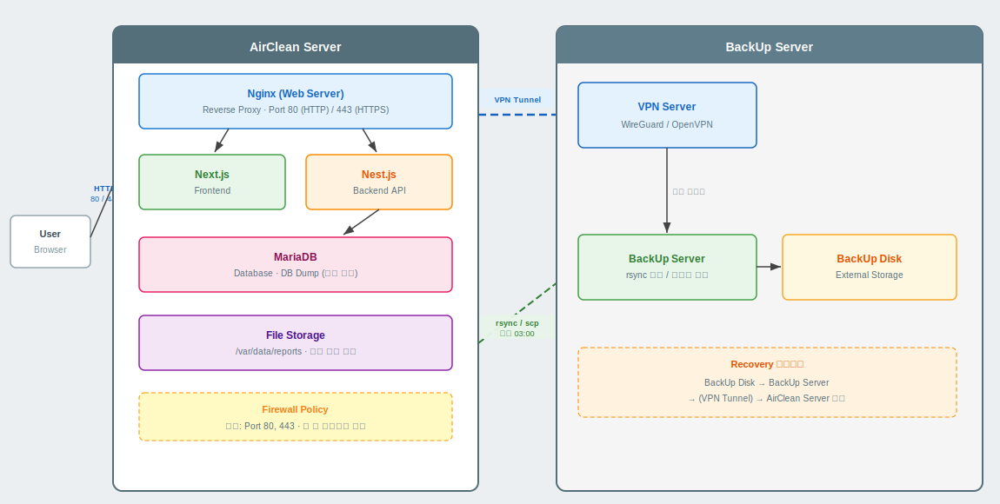

## 1. 인프라 개요 (Overview)

- **목적:** AirClean 서비스의 원활한 운영과 안전한 데이터/파일 관리를 위한 물리적, 논리적 인프라 구조 정의

- **핵심 환경:** 로컬 서버 운영 기반, 백업 서버 분리

## 2. 전체 시스템 아키텍처 (Overall System Architecture)

  
- **주요 구성 요소 리스트:**

| 구분         | 서비스     | 상세                  |
| ---------- | ------- | ------------------- |
| Web Server | Nginx   | 리버스 프록시             |
|            |         | 정적 파일 제고            |
| Frontend   | Next.js | 웹 어플리케이션            |
| Backend    | Nest.js | API 서비스 및 백엔드 로직 수행 |
| Database   | MariaDB | RDBMS               |

## 3. 네트워크 및 통신/보안 구조 (Network & Security)

> 💡 **[Figma 다이어그램 삽입 위치: 네트워크 및 포트 정책]**

> (방화벽 구성, 외부 개방 포트(80, 443), 내부 통신망, KISA 권고 알고리즘이 적용된 데이터 암호화 통신 흐름)

  
- **포트 및 방화벽 정책 요약**

- **인증 및 통신 보안 (HTTPS, JWT 흐름)**

  

## 4. 파일 스토리지 흐름도 (File Storage Flow)

> 💡 **[Figma 다이어그램 삽입 위치: 파일 업로드/다운로드 아키텍처]**

> (대용량 보고서 및 이미지가 백엔드를 거쳐 로컬 서버의 특정 디렉토리(`/var/data/reports` 등)에 저장되고 클라이언트로 서빙되는 과정)

- **파일 디렉토리 구조 및 접근 권한 정책**

- **대용량 파일 처리 및 병목 최소화 전략**

  

## 5. 백업 파이프라인 (Backup & Dump Pipeline)

> 💡 **[Figma 다이어그램 삽입 위치: Dump 및 백업 서버 연동 구조]**

> (메인 서버의 DB Dump 스크립트와 로컬 파일 디스크 압축 파일이 정해진 주기(Cron)마다 분리된 '백업 서버'로 전송되는 흐름도)

- **백업 대상:** MariaDB Dump 파일, 로컬 보고서 디렉토리 전체

- **백업 주기 및 전송 방식:** 
	- 일시 : 매일 새벽 1시
	- rsync로 사용
	-  VPN으로 연결된 네트워크 사용

- **장애 발생 시 복구(Recovery) 시나리오**
	- 장애 발생시 관리자 서비스에서 날짜 선택으로 해당 날짜의 데이터로 복구
